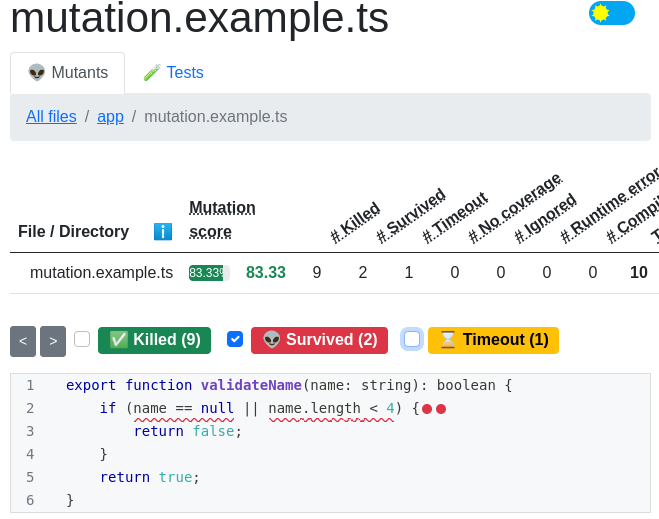
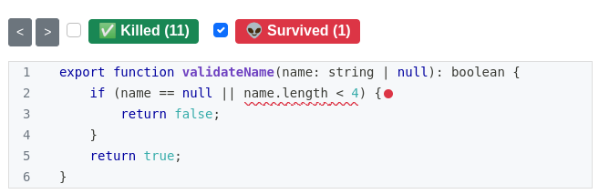

## Introduction

This blog post is designed to serve as a comprehensive guide for developers looking to apply mutation testing into their `Angular` application.

If you are that developer, you will be able to carry out mutation testing with ease by following the working configurations and examples provided below.

If you just happened onto this tutorial, you will gain a decent understanding of mutation testing. Please see [here](#what-is-mutation-testing) for a definition of the mutation test.

##
 
> **Note**: For Angular, it is `Stryker` software to provide mutation testing capabilities.


## Configuration

#### Install
The first step is to install `stryker-cli` to initiate the Stryker project inside the Angular application.

Run the following command to install Stryker-cli.

```bash
npm install --global stryker-cli
```

#### Initialize Stryker project

Run the following command to configure the Angular project with the Stryker mutation testing framework. To do so, please move into your application’s home directory.

```bash
stryker init
```

This will create the following file in the Angular application root folder.

#### striker.conf.json
```json
{
  "$schema": "./node_modules/@stryker-mutator/core/schema/stryker-schema.json",
  "_comment": "This config was generated using 'stryker init'. Please see the guide for more information: https://stryker-mutator.io/docs/stryker-js/guides/angular",
  "mutate": [
    "src/**/*.ts",
    "!src/**/*.spec.ts",
    "!src/test.ts",
    "!src/environments/*.ts"
  ],
  "testRunner": "karma",
  "karma": {
    "configFile": "karma.conf.js",
    "projectType": "angular-cli",
    "config": {
      "browsers": [
        "ChromeHeadless"
      ]
    }
  },
  "reporters": [
    "progress",
    "clear-text",
    "html"
  ],
  "concurrency": 2,
  "concurrency_comment": "Recommended to use about half of your available cores when running stryker with angular",
  "coverageAnalysis": "perTest"
}
```
## Example

Let's have a look at a very simple unit test example.

#### mutation.example.ts
```javascript
export function validateName(name: string): boolean {
    if (name == null || name.length < 4) {
        return false;
    }
    return true;
}
```

and 100% code coverage unit test for the above method is

#### mutation.example.spec.ts
```javascript
import { validateName } from "./mutation.example";

describe("Mutation test example.", () => {

    it("Should return false for short name.", () => {
        let name = "abc";
        expect(validateName(name)).toBeFalse();
    });

    it("Should return true for correct name.", () => {
        let name = "Benjamin";
        expect(validateName(name)).toBeTrue();
    });
});

```

Code coverage will be

```bash
TOTAL: 8 SUCCESS

=============================== Coverage summary ===============================
Statements   : 100% ( 11/11 )
Branches     : 100% ( 3/3 )
Functions    : 100% ( 3/3 )
Lines        : 100% ( 9/9 )
================================================================================
```

Everything appears to be correct to an impulsive developer, but when we run a mutation test against it, we discover a hidden flaw.
The mutation test reveals the other side of the story. 

#### mutation test report


Red dots indicate the surviving mutations.


## How it works

Let's see how mutation tests work.


```javascript
export function validateName(name: string): boolean {
-    if (name == null || name.length < 4) {
+    if (false || name.length < 4) {
        return false;
    }
    return true;
}

```
So it replaces the `name == null` condition statement with a `false` statement and test cases run against this modified code. If the test passes, then it states that a mutation exists. Our job is to remove that mutation by adding a unit test case that handles such a scenario.

If we study the unit test cases and source code, we can see that there is no use of `name == null`, hence we must write a test case to pass an empty string and test it.


## Update Unit Test Cases

The following is a unit test case to tackle the empty name condition check.

```javascript
it("Should return for empty name", ()=>{
      let name = null;
      expect(validateName(name)).toBeFalse();
  });
```
Next, Run following command

```bash
stryker run
```
And now the report will be like



Report shows `name == null` mutation is removed.


## What is Mutation Testing
Mutation testing is specialised software that improves unit testing in any programming language. Though it does not improve code coverage, it does identify the types of edge cases that we generally overlook.

  **How does it work?**  Well, in a nutshell, it changes the application code at run time before unit tests are executed and those test cases are run against the modified code.

**What does it change in code?** it changes many things for example

If you have a condition statement like `a > b` then it changes it to `a < b`.

Now your unit tests should handle such scenarios. If the test case fails, then it implies that the test case has eliminated the mutation from the code. If it doesn't, then there is a need for improvement in test cases.

## Stryker Mutation Framework
As mentioned earlier, every language has specialised software for mutation testing. For Angular, it is Stryker software.
It is an open source project and it supports more than 30 mutations.
It also provides a very convenient report, which will help to improve test cases.
For more information, go to its official [website](https://stryker-mutator.io/). 

## Conclusion

Mutation testing can also be supported by a sophisticated framework such as Angular. Though it reduces productivity since mutation test execution is slow, but it improves application sustainability, which we need in the long term.

------

#### This blog post uses following softwares
* Angular: 13.2.7
* Node: 16.14.0
* Typescript: 4.5.5
* Stryker: 6.1.2

-------

## Source Code

You can find source code used in this tutorial on [Github](https://github.com/zainabed/tutorials/tree/master/angular/blog-app) page.
