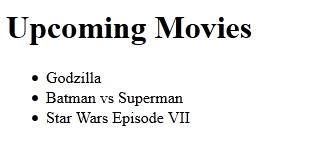

## Introduction

This tutorial will help you to create a dynamic web application using power of AngularJs.

## What is AngularJs
AngularJs is javascript MVC framework (maintained by Google) which molds static HTML application to dynamic web application. That was a brief introduction, you can find more information on Wiki and AngularJS Site.

AngularJs follows MVC pattern to separate out model from view and manage it by controller. 

See this image


Goal of using AngularJs is to convert static HTML template to dynamic (Angular) template.
 
## How to convert static template to dynamic (Angular) Template
Now consider the following static HTML template which contain list of movies title.

```html
<h1>Upcoming Movies</h1>
<ul>
    <li>
      <span>Godzilla</span>
    </li>
    <li>
      <span>Batman vs Superman</span>
    </li>
    <li>
      <span>Star Wars Episode VII</span>
    </li>
</ul>
```

Now lets convert above static HTML template into AngularJs Template by injecting Model-View-Controller by using following steps.

1. Create AngularJS module object in javascript which will be the root scope of the AngularJs template.
2. Using above module object create controller function which will hold the model resource (like JSON objects).
3. Within this controller create or access model object (JSON object) using $scope variable.
4. Now Inject module and controller Angularjs tags into view (static HTML template) and access the model object (JSON object) inside view.

Following is blueprint of steps which we are going to perform inside static template.


> **NOTE**:
> 1. ng-repeat AngularJS tag is used to iterate JSON array
> 2. ``{{}}`` AngularJS tag is used to output content inside HTML

Now let’s create JavaScript code for AngularJs module and controller.
We will create a JavaScript file named ``app.js``

```javascript
// create module
var firstApp = angular.module("firstApp",[]);

// create controller
firstApp.controller("mainController", function($scope){

  // create model object
  $scope.movies = [{title: "Godzilla"},{title: "Batman vs Superman"},{title: "Star Wars Episode VII"}];

});
```

Now just include this JavaScript file and ``angular.js`` file in static HTML template
And run the application.

you will see the following result




## Source Code
You can find source code used in this tutorial on [Github](https://github.com/zainabed/tutorials/tree/master/angularjs/getting_started) page.
