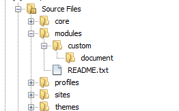
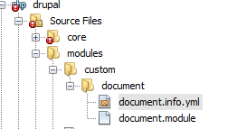

## Introduction

Custom Module development in Drupal 8 is very simple. It may looks very difficult for developer who has Drupal 7 experience or nothing at all.

This tutorial will show easy steps and helps you to create custom module within few minutes.

> **Note**: Content or example of this tutorial may change according to Drupal 8 version and its release.

This tutorial is divided into three small sections.

In first section of this tutorial we will see what directory structure we need to create for a custom module.

In second section we will see what type files we need to create.

And in last section we will see what code we need to write in those files and configure them in Drupal 8.

## Directory Structure

All custom module in Drupal 8 reside under “module” directory of Drupal 8 project.

To create a custom module we will create a new directory named “document” under custom folder.

Following is directory structure.





## Configuration files
Second thing that we need to create is YAML files which represent custom module configurations.

Followings are files that you need to create.

- {module name}.info.yml   ``i.e  document.info.yml``
- {module name}.module   ``i.e  document.module``

only document.info.yml file is enough for configuring of document module.

Following is directory structure after including these files





## Writing Configuration Settings
Add following code inside document.info.yml


```yml
name: Document
description: Document Module
package: Document
core: 8.x
version: 1.0
type: module
```


Above configuration settings are very descriptive except only one parameter which is ``type``.

As we are creating custom module therefore type parameter must be typed as ``module``.

Now your module is ready to enable and use.

Go to Drupal Admin page and enable document module from

``Admin->Extend link``

Now search ``document`` module in search list

Then select check box before document module name and click ``Save Configuration`` button.

That’s it, custom document is now ready to use

Next tutorial will help you create custom controller for this custom module.