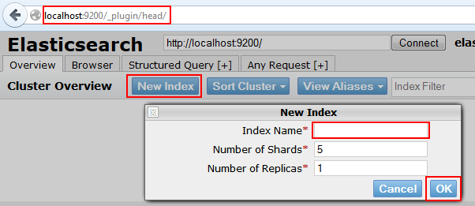
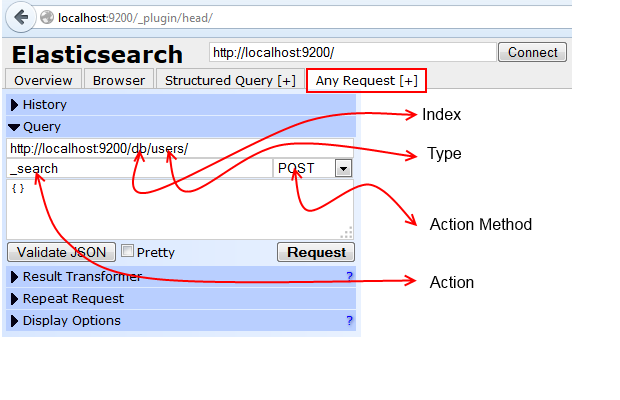
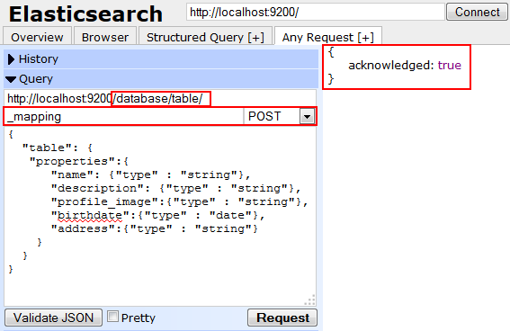
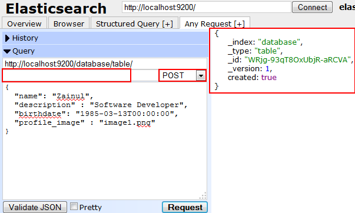
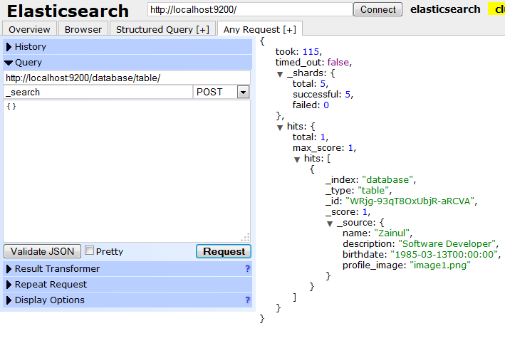
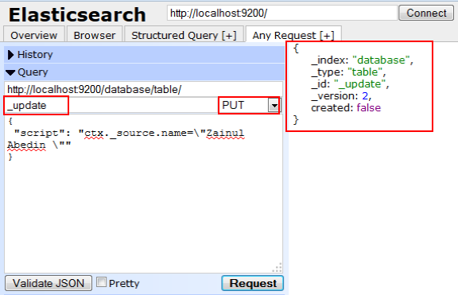
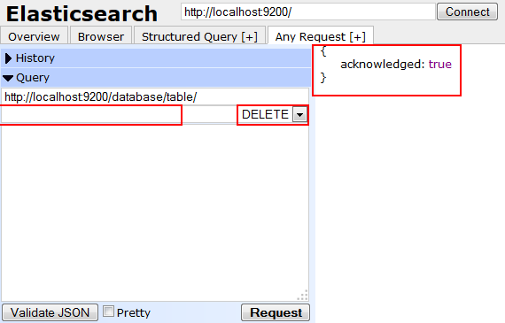

## Introduction

Elasticsearch is open source search system based of Apache Lucene. this is a brief introduction, you can find more information on Elasticsearch Official Site or  Wiki.


## What are features of Elasticsearch

Here are list of features of Elasticsearch.

- Real Time Search and Analytic.
- Distributed Data (Scales Horizontally) 
- Based on Apache Lucene
- High Availability
- Full Text Search
- JSON Based Documents
- RESTful API
- Multi Facets
- Geo Location Search
- Open Source

## How to install ElasticSearch

Download the latest version from [Elastic](https://www.elastic.co/).

Then unzip it or use following command in console to download Elasticsearch.

```bash
curl -L -O http://download.elasticsearch.org/PATH/TO/LATEST/$VERSION.zip
unzip elasticsearch-$VERSION.zip
cd  elasticsearch-$VERSION
```

Now move to unzip folder and run following command

``{elasticsearch unzip folder path}/bin/elasticsearch``

It will start Elasticsearch.

## How to use ElasticSearch

To interactive with data using Elasticsearch we will use ``head plugin`` of Elasticsearch.

To install head plugin in your system run following command.

```bash
{elasticsearch unzip folder path}/bin/plugin --install mobz/elasticsearch-head
```

After successful installation open your favorite browser and  type following URL to use head plugin.

```
http://localhost:9200/_plugin/head
```

It will open head plugin user interface, now we can manipulate Elasticsearch records.

To start with data manipulation, first we need to create ``Index`` and ``Type``.

Index acts as Database and Type as Table, therefore we can have multiple Type inside single Index.

First create new index, to create new index click button New Index from homepage of head plugin.





Then type name of index (for this blog we type "database" as Index and use Type as "Table") and click Ok.

It will create new index on Elasticsearch.

## How to perform CRUD operation on Elasticsearch

To perform CRUD operation on Elasticsearch select Any Request Tab
It will open user interface as shown below



There are several section defined in above image. lets see them one by one

- **Index**: Index on which you want to perform action, it is located just after localhost:9200/
- **Type**: Type within selected Index, it will come after Index value.
- **Action**: which type of action you want to perform like search, mapping, etc.
- **Action Method**: it is REST API action methods like POST, GET, PUT, DELETE.

Following is record or document structure that we are going to create.

```javascript
{
   name : String,
   description: String,
   profile_image : String,
   birthdate : Date,
   address: String
}
```

## Create Mapping
First new need to define structure of data, by default it would be string for all fields but we can set different data type as date, geo point, etc.

To define mapping, select Index and Type, then type _mapping in Action area to perform mapping related tasks, then select Action Method as POST and type following mapping structure and click on Request button. 

```json
{
  "table": {
   "properties":{
      "name": {"type" : "string"},
      "description": {"type" : "string"},
      "profile_image":{"type" : "string"},
      "birthdate":{"type" : "date"},
      "address":{"type" : "string"}
    }
  }
}
```


To ensure mapping is created , just change Action Method to GET and click Request button.


## Create Record
To create record on selected Index and Type, make Action  value empty 
and Action Method as POST after that add following JSON record.

```json
{
  "name": "Zainul",
  "description" : "Software Developer",
  "birthdate": "1985-03-13T00:00:00",
  "profile_image" : "image1.png"
}
```
And click on ``Request`` button. It will index the one record.





## Read Indexed Records
To fetch indexed records from Elasticsearch, select Index and Type then Action as _search and Action Method as POST , make query body empty then click on Request button.
It will fetch 10 records from selected Index and Type.





## Update Records

To update value of name field, select Index and Type then Action as _update and Action Method as PUT and add following JSON record in query section then click on Request button.

```json
{
 "script": "ctx._source.name=\"Zainul Abedin \""
}
```




to check record is updated or not, fire search query.

## Delete Records
To delete record from selected Index and Type, make Action value empty and select Action Method as DELETE and click on Request button.




This is a brief introduction to CRUD operations. in next blog post you will see how to access Elasticsearch via Java Client.