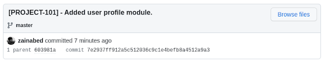
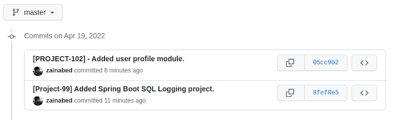

## Introdcution 

In this tutorial, we'll go over how to fix ``Git commit messages`` that have been committed to a local or remote Git repository.

## Reason to change commit message?

When working with Git, there could be several reasons to update the commit message.
Some of the common reasons are as follows

- Message contains a typo.
- Missing intent of commit.
- Remove any confidential information.
- Correct issue ticket number to connect to an issue tracker such as Jira.

## Solution

The reason could be anything, but you should be aware of the command to update the commit message at any point in the development of your application.

Let's take a look at the solution for a single commit message.

## Local commit

Assume you perform the following Git operation.

```bash
$ git add -A
$ git commit -m "[PROJECT-99] - Added user profile module."
```

And after you realise that the issue number for the current commit is incorrect and needs to be corrected. That's the story of Project 100.

You can correct it using the method outlined below.

```bash
$ git commit --amend -m "[PROJECT-100] - Added user profile module."
```

If you look at git log then updated message will reflect in it.

```bash
commit 75c82d058b32b82b5724618c816684c5aaa59022 (HEAD -> master)
Author: User
Date:   Tue Apr 19 01:08:53 2022 -0400

    [PROJECT-100] - Added user profile module.
```

## Remote commit

The following approach can be used to correct the latest pushed commit.

```bash
$ git commit --amend -m "[PROJECT-101] - Added user profile module."
```
 
And git log history will show the latest updated message as

```bash
commit 7e2937ff912a5c512036c9c1e4befb8a4512a9a3 (HEAD -> master)
Author: User
Date:   Tue Apr 19 01:08:53 2022 -0400

    [PROJECT-101] - Added user profile module.
```


However, because this change occurs in your current working directory, you must run the command below to update the remote repository.

```bash
$ git push --force origin master
```

When you look at the remote repository, you'll notice that the most recent message has been added to it.
 



## Changing an Older or Multiple Commits
If you ever need to change multiple commits for some reason, use Git interactive rebase.

Git rebase rewrites the history, and it is strongly advised not to use rebase unless there is a compelling reason to use it.

Use the command ```git rebase -i HEAD~N```, where N represents the number of commits to update.
As an example,

```bash
$ git rebase -i HEAD~3
```

It will launch an editor and allow you to choose three commits from the history.

```bash
pick 6bfbd01 Added Cucumber + Gradle project
pick 603981a Added Spring Boot SQL Logging project.
pick 7e2937f [PROJECT-101] - Added user profile module.

# Rebase 0d7b04f..7e2937f onto 0d7b04f (3 commands)
```

Navigate to the line you want to change and replace the pick word with the reword.


```bash
pick 6bfbd01 Added Cucumber + Gradle project
reword 603981a Added Spring Boot SQL Logging project.
reword 7e2937f [PROJECT-101] - Added user profile module.
```

Save and exit the editor now. For each reword commit, Git will launch a new editor.

```bash
[Project-99] Added Spring Boot SQL Logging project.
```

Save and exit the editor after updating the commit message.

This will bring your local git history up to date. Use the following command to update remote Git history.

```bash
$ git push --force origin master
```

It will update remote Git history as.



## Conclusion

Use the ```git commit --amend``` command to change the most recent commit message. Use git rebase ```-i HEAD~N``` to change older or multiple commit messages.

Don't change remote commits using rebase because it could cause a lot of problems for your colleagues.
