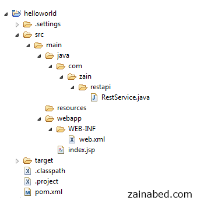
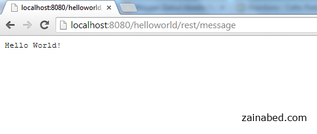

## Introduction

Following is simple JAX-RS tutorial, which sends “Hello World” text as response string using JAX-RS API and Jersey implementation.
Technologies and Tools used in this article:

1.    JDK 
2.    Eclipse 
3.    Tomcat
4.    Maven 
5.    Jersey 1.8

## Create Maven Web Project

Create a Maven web project and name it "helloworld" .

- File -> New -> Other -> Maven Project -> Next
- Select maven-archetype-webapp
- Select Next
- Type Group Id, Artifact Id and Package name
- And select Finish

## Add Project Dependencies

Add Jersey repository using Maven. 
Use [Maven](http://mvnrepository.com/artifact/com.sun.jersey/jersey-server) URL to get appropriate repository.

Now update ``pom.xml`` file by adding following dependency.

#### File : pom.xml
```xml
  <dependency>
     <groupId>com.sun.jersey</groupId>
     <artifactId>jersey-server</artifactId>
     <version>1.8</version>
  </dependency>
```

## Create REST Service

Now it is time to create a class which serves as REST service.
Create class named ``RestService`` and a public method ``getMessage``

```java
package com.zain.restapi;

import javax.ws.rs.core.Response;
import javax.ws.rs.GET;
import javax.ws.rs.Path;


@Path("/message")
public class RestService {

 @GET
 public Response getMessage() {

  String message = "Hello World!";

  return Response.status(200).entity(message).type("text/plain").build();
 }
}
```

> **Note**: ``@Path`` annotation act as routing which map incoming URI to appropriate Class
Update web.xml for Jersey configuration
In web.xml, add servlet with class ``com.sun.jersey.spi.container.servlet.ServletContainer``


#### File : web.xml

```xml
<web-app  version="2.4"
       xmlns="http://java.sun.com/xml/ns/j2ee"
       xmlns:xsi="http://www.w3.org/2001/XMLSchema-instance"
       xsi:schemaLocation="http://java.sun.com/xml/ns/j2ee
       http://java.sun.com/xml/ns/j2ee/web-app_2_4.xsd">
      
       <servlet>
              <servlet-name>jersey-serlvet</servlet-name>
              <servlet-class>
                     com.sun.jersey.spi.container.servlet.ServletContainer
                </servlet-class>
              <init-param>
                   <param-name>com.sun.jersey.config.property.packages</param-name>
                   <param-value>com.zain.restapi</param-value>
              </init-param>
              <load-on-startup>1</load-on-startup>
       </servlet>

       <servlet-mapping>
              <servlet-name>jersey-serlvet</servlet-name>
              <url-pattern>/rest/*</url-pattern>
       </servlet-mapping>
</web-app>   
```

## Directory Structure

Final project directory structure



## Demo

To execute this application you need to type following URL

```
http://localhost:8080/{project name}/{jersey servlet name}/{@path param value}
```
here is actual URL for this tutorial.

```
http://localhost:8080/helloworld/rest/message
```



## Source Code

Download source code from this [Github](https://github.com/zainabed/tutorials/tree/master/java/jax-rs/helloworld)


## References

- [Jersey Official Website](http://jersey.java.net/)
- [Jersey hello world example](http://www.mkyong.com/webservices/jax-rs/resteasy-hello-world-example/)
- [RESTful Web Services](http://www.oracle.com/technetwork/articles/javase/index-137171.html)
