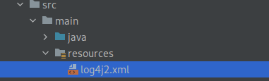

## Introduction

This tutorial will help you to log all level messages into console using Log4j plugin.

In previous tutorial we have seen how to setup the log4j plugin in Maven and simple logging application.
If you need to understand the basic of Log4J the visit [previous tutorial]().


## What we will do in this tutorial
We saw in the previous tutorial that Log4J's default configuration set the logging level to ``Error``, causing it to log only errors and fatal messages to the console.

To overcome this problem, we need to override the default configuration. To do so, we need to write a Log4j configuration file named ``Log4j2.xml`` and update the correct logging level. 

Log4j supports YAML, JSON, and XML file formats for its configuration files. For this tutorial we are using Log4j2.xml


## Sample Log4j2.xml

```xml
<?xml version="1.0" encoding="UTF-8"?>
<Configuration status="ERROR">
    <Appenders>
        <Console name="Console" target="SYSTEM_OUT">
            <PatternLayout pattern="%d{HH:mm:ss.SSS} [%t] %-5level %logger{36} - %msg%n"/>
        </Console>
    </Appenders>
    <Loggers>
       ` <Root level="ERROR">
            <AppenderRef ref="Console"/>
        </Root>
    </Loggers>
</Configuration>
```

> **Note** : Place the Log4j2.xml file in the classpath, or in the ``src/resources`` directory for Maven projects.




## Console Appender

The Appender configuration tag tells where to log the messages, it could be console or file.

The Console appender sets out a layout to log the message by defining the pattern. The pattern can include date and time, level of message, message itself, etc.

- **target** : Either ``SYSTEM_OUT`` or ``SYSTEM_ERR``. The default is SYSTEM_OUT.
- **pattern** : The log messages are formatted using a combination of literals, conversion characters, and format modifiers, according to the pattern.

## Sample Code

```java
import org.apache.logging.log4j.LogManager;
import org.apache.logging.log4j.Logger;

public class MainApp {

    public static void main(String[] args) {
        Logger logger = LogManager.getLogger();
        printLoggingLevels(logger);
    }

    private static void printLoggingLevels(Logger logger) {
        logger.trace("logging trace level");
        logger.debug("logging debug level");
        logger.info("logging info level");
        logger.warn("logging warn level");
        logger.error("logging error level");
        logger.fatal("logging fatal level");
    }
}
```

You will get the following output on the console as you run the application.

```bash
02:29:50.976 [main] ERROR com.zainabed.tutorials.logging.MainApp - logging error level
02:29:50.979 [main] FATAL com.zainabed.tutorials.logging.MainApp - logging fatal level
```

Still, we get only Error and Fatal messages even after creating the custom configuration file. 

To understand the problem, we need to learn the logging level defined for Log4j.


## Logging level filter revisit

Log4j has the following filter mechanism.

**All <  Trace < Debug < Info < Warn < Error < Fatal**

If the logging level is set to be Debug, then Debug, info, warning, error, and fatal messages will be logged into the console.

When the logging level is set to "Error," both the Error and Fatal messages are displayed.

So we need to update the Root level from Error to Debug.

## Updated Log4j2.xml

```xml
<?xml version="1.0" encoding="UTF-8"?>
<Configuration status="ERROR">
    <Appenders>
        <Console name="Console" target="SYSTEM_OUT">
            <PatternLayout pattern="%d{HH:mm:ss.SSS} [%t] %-5level %logger{36} - %msg%n"/>
        </Console>
    </Appenders>
    <Loggers>
       ` <Root level="DEBUG">
            <AppenderRef ref="Console"/>
        </Root>
    </Loggers>
</Configuration>
```

Here we have updated the Root level from Error to Debug.

Rerun the application and you will get the following output.

```bash
02:32:27.675 [main] DEBUG com.zainabed.tutorials.logging.MainApp - logging debug level
02:32:27.680 [main] INFO  com.zainabed.tutorials.logging.MainApp - logging info level
02:32:27.680 [main] WARN  com.zainabed.tutorials.logging.MainApp - logging warn level
02:32:27.680 [main] ERROR com.zainabed.tutorials.logging.MainApp - logging error level
02:32:27.680 [main] FATAL com.zainabed.tutorials.logging.MainApp - logging fatal level
```

## Conclusion 

In this tutorial, we learned the importance of the Log4j2.xml configuration. How to control the logging level and medium of output .

In the next tutorial, we will learn how to log the messages into a file.

You can find the source code on [Github](https://github.com/zainabed/tutorials/tree/master/maven/log4j-maven).