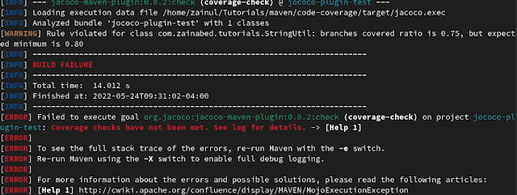
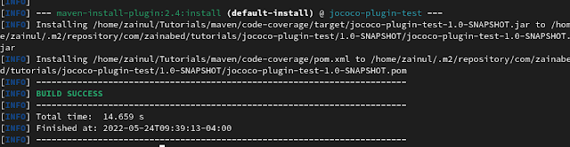
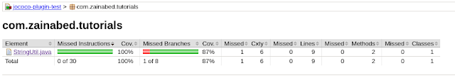

## Introduction

In this tutorial we will see how to setup the JaCoCo plugin to generate a code coverage report for a Maven project.

In order to generate a unit test coverage report, we should have sufficient unit test cases in our application. For this tutorial, I am referring to a Maven project which has a string manipulation method.

You can find this project at this [GitHub](https://github.com/zainabed/tutorials/tree/master/maven/code-coverage) location.

There are a few steps that need to be taken to produce the report.

## Install the Maven JaCoCo plugin.

Insert the following code into pom.xml.

```xml
<plugin>
    <groupId>org.jacoco</groupId>
    <artifactId>jacoco-maven-plugin</artifactId>
    <version>0.8.2</version>
    <executions>
        <execution>
            <goals>
                <goal>prepare-agent</goal>
            </goals>
        </execution>
        <execution>
            <id>report</id>
            <phase>test</phase>
            <goals>
                <goal>report</goal>
            </goals>
        </execution>
    </executions>
</plugin>
```

## Add a Unit Test

Create a class as ``StringUtil.java`` and add following snippet.

```java
package com.zainabed.tutorials;

public class StringUtil {

    public int findIntegerCount(String input) {
        
        if (input == null) {
            return 0;
        }
        
        int count = 0;
        for (int index = 0; index < input.length(); index++) {
            char character = input.charAt(index);
            if (character >= 48 && character <= 57) {
                count++;
            }
        }
        
        return count;
    }
}
```

Next, create a unit test class for above class as ``StringUtilTest.java``.

```java
package com.zainabed.tutorials;

import org.junit.jupiter.api.Test;

import static org.junit.jupiter.api.Assertions.assertEquals;


class StringUtilTest {

    @Test
    void should_return_count_of_numeric_value() {
        StringUtil stringUtil = new StringUtil();
        String input = "1name34sample;";
        assertEquals(3, stringUtil.findIntegerCount(input));

        input = "namesample";
        assertEquals(0, stringUtil.findIntegerCount(input));
    }
}
```

Now execute the maven build. It will generate the code coverage report.

```bash
mvn clean install
```

Build will generate following code coverage result


You can configure different goals of the JaCoCo plugin, such as restricting code coverage percentage.

Our application has ``75%`` branch coverage so far. Let's use the following snippet to configure the coverage limit by setting the execution configuration of the JaCoCo plugin and setting the value to ``80%``.

```xml
<execution>
	<id>coverage-check</id>
	<phase>test</phase>
	<goals>
	    <goal>check</goal>
	</goals>
	<configuration>
	    <rules>
		<rule>
		    <element>CLASS</element>
		    <limits>
		        <limit>
		            <counter>BRANCH</counter>
		            <value>COVEREDRATIO</value>
		            <minimum>80%</minimum>
		        </limit>
		    </limits>
		</rule>
	    </rules>
	</configuration>
</execution>
```

Now with this configuration build will fail.




We can make the build pass by improving the branch code coverage. Let us update the unit test as follows.

```java
 @Test
    void should_return_zero_for_empty_string() {
        StringUtil stringUtil = new StringUtil();
        assertEquals(0, stringUtil.findIntegerCount(null));
    }
```

Build the application again.

```bash
mvn clean install
```

Build will result the success as shown in following diagram



And the new report will include the code coverage above ``80%``.



## Conclusion

Code coverage is a useful asset to improve unit testing of applications and JaCoCo facilitates it efficiently.