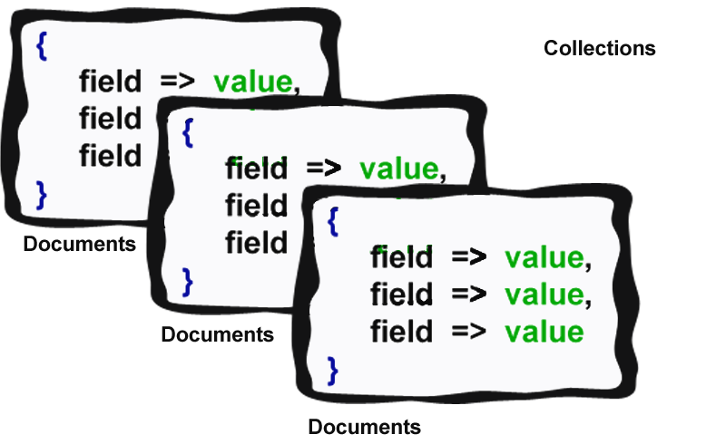

## Introduction

MongoDB is a No-SQL open source database system that stores information in documents.

MongoDB was created with excellent performance and accessibility in mind.

A document is a collection of fields and value pair combinations that are stored in BSON (binary representation of JSON records), which is the native data type in most languages.

MongoDB uses collections to hold groups of documents.




Now let’s see the basic operations that can be handled in MongoDB.
- Create
- Read
- Update
- Delete

collectively called the "CRUD operation"


## Create Operation

MongoDB performs atomic creation operations on single documents. It adds a new document to the selected collection.

```javascript
db.{collection_name}.insert({
                 field => value,
                 field => value,
                 field => value,
});
```

The value could be a simple datatype or something more complex (document or array).

The Create operation always adds the unique identifier of the ObjectId data type to the newly created document.

ObjectId is a 12-byte BSON primarily used to maintain uniqueness in a collection.

The following is the byte structure of ObjectId.


- 4 byte for Unix epoch value
- 3 byte for machine identifier
- 2 byte for process identifier
- 3 byte for some random value

## Example

```javascript
db.user.insert({
                name : 'Zainul',
                email: 'zainabed@gmail.com',
                address : 'XYZ Address'
})
```

## Read Operation

The Read operation fetches documents from a single or selected collection. It uses projection and conditions to modify the resulting documents.

Project is used to retrieve only specific fields of a document, which speeds up the read operation.
Condition is used to select a particular document which falls under a given condition.


```javascript
db.{collection}.find(
           { condition },
           { projection }
)
```
We can use limit and sort to limit and order the resulting documents.
Note: the order of resulting documents is not defined unless we provide an order for documents.


## Example 

```javascript
db.user.find(
        { name: 'Zainul' }, { name : 1, email : 1}
)
```

This command will return a set of documents from a user collection whose name matches the given condition, and will fetch only the name and email.
Note: the read operation always returns an ID unless we omit it by using query projection.


## Update Operation

Update operations modify existing documents or even create new documents. It uses update criteria to isolate documents and update actions to modify the values of selected documents.

```javascript
db.{collection}.update(
           { update criteria },
           { update action },
           { update option }
)
```

The Update option tells MongoDB to update multiple documents.

## Example

```javascript
db.user.update(
        { name : 'Zainul' },
        { $set : { name :  'Abedin' } }
)
```

> Note: Use upsert to create a new document if that document does not exist.


## Delete Operation

The Delete operation removes single or multiple documents from a selected collection. It uses remove criteria to identify the document that is to be removed.

```javascript
db.{collection}.remove(
     {remove criteria}
)
```

If the criteria for removal are not defined, then it will remove all the documents.


## Example

```javascript
db.use.remove(
      { name :  'Abedin' }
) 
```


## Conclusion 

In this post, you learned about MongoDB's architecture, learned about CRUD operations in MongoDB, and saw some examples of how to use CRUD operations in MongoDB. Hopefully, you now have a clear understanding on how to apply these principles to your MongoDB project.