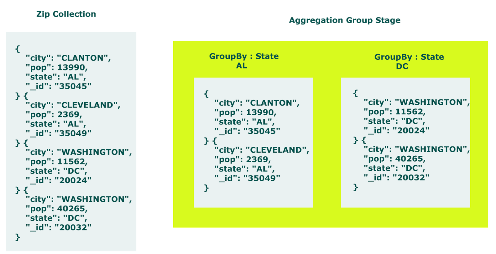
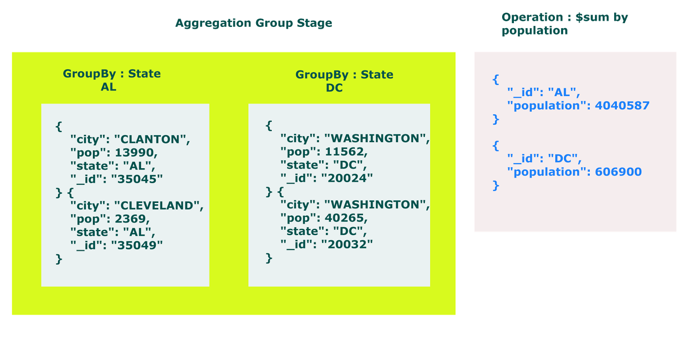

## Introduction

MongoDB Aggregation Framework groups set of documents together and performs certain operation on this grouped documents and returns results in the form of documents.
MongoDB aggregation answer to those query which requires grouping of documents.


Aggregation framework works on three type of model

- Aggregation pipeline
- Map Reduce
- Single Purpose Aggregation Operations

 
Now let see how MongoDB Aggregation Framework works with simple example.

Suppose you are MongoDB application developer in a respected company and you have been given a MongoDB database that holds information about human population which is distributed according to cities and their states.

here is one sample document.

```javascript
{
        "city" : "ACMAR",
        "loc" : [
                -86.51557,
                33.584132
        ],
        "pop" : 6055,
        "state" : "AL",
        "_id" : "35004"
}
```

for this tutorial collection name is zips. 

on first day your manager come and asks you to calculate total population of state DC.

your simplest approach to solve above query would be find all documents which have DC as state. then iterate them one by one and add population to a variable.
 
 here is the a sample script 

 ### MongoDB script 1
 
```javascript
 var record = db.zips.find( { "state" : "DC"} )
 var sum = 0;
 record.forEach(function(rec){ sum = sum + rec.pop })
 print("Total population of State DC = " + sum)
```

Total population of State DC = 606900

This works fine and given task is done.
 
later,  next day your manager comes and tells you to find total population of each states.

now this query is little tricky, but you would modify you first MongoDB script and make it is given below.

### MongoDB script 2

```javascript
 var states = db.zips.distinct("state")
 
 states.forEach(function(state){

   var records = db.zips.find({"state" : state});
   var sum = 0;

   records.forEach(function(record){
     sum = sum + record.pop;
   });

   print( state + " population: " + sum);
 });
```
yes, it will give you expected result. no doubt you are a good MongoDB developer.

but you have put extra efforts get result. it does not mean that you are not a good developer, rather you are not aware of MongoDB aggregation framework which produce expected result in one query.

following is aggregation query

```javascript
db.zips.aggregate([ { "$group" : { "_id" : "$state", "population" : { "$sum" :
 "$pop" } }} ])
 ```

 it will give you same result which in equivalent of second MongoDB script.
 
now let see how it works. 

First look out the group clause of aggregate query.
 
```javascript
db.zips.aggregate([ { "$group" : { "_id" : "$state" } } ])
```
  
It will group collections according  to state




  
as documents are grouped now we can perform calculation on them like summation of population.

```javascript
db.zips.aggregate([ { "$group" : { "_id" : "$state", "population" : { "$sum" :
 "$pop" } }} ])
 ```




hence you get expected result in one query using MongoDB Aggregation Framework.

