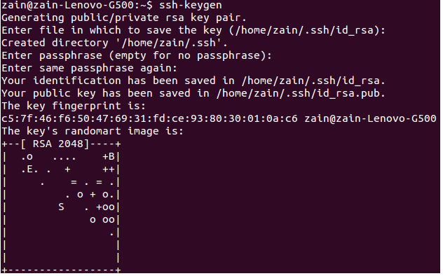

## Introduction

This post will show you how to generate SSH private and public keys step by step, as well as how to add public keys to your GitHub and Bitbucket accounts.

## But first, why do we require this SSH public key

If you want to do any work on a secure GIT repository, such as cloning or pushing your latest changes, you will need to provide your credentials to help GIT authenticate you and approve those operations, whether you are working in a team or as an individual.

However, each time you operate, you are prompted to enter your username and password.

It appears simple at first, but it quickly becomes a source of frustration.

To overcome the above problem, we can use the SSH protocol. SSH connections allow us to authenticate using public and private keys that we generate only once. after that, we don't need to authenticate because SSH will do so on our behalf.


## But how does it work

SSH authenticates you using an identity, and this identity is made up of a combination of private and public keys.

A private key is stored on your local machine, while a public key is stored on your GitHub or Bitbucket account.
When you perform any operation on a Git repository that requires your authentication, SSH combines these two keys.


To use SSH, you must first install it. Please follow the steps given in the following link.
[http://www.openssh.com](http://www.openssh.com)


## Generate private-public keys

Follow the steps below to generate a private and public key.
Open a terminal and enter the following command.

```bash
ssh-keygen            
```

It will request the location of key files. To select the default location, press Enter.

It will then request a ``passphrase`` (password). You can omit it, but it is preferable to include one.

After that, it will prompt you to reenter your password for confirmation.

After that, keys will be generated and saved in the specified location.

Here's an example of the ssh-keygen operation's output.





Next, add your key to the ssh-agent.

```bash
ssh-add ~/.ssh/id_rsa    
```
Later, you need to add the public key to your GitHub and Bitbucket accounts. To do so, we need to get content of the public key. This resides inside ~/.ssh path.

```bash
cat ~/.ssh/id_rsa.pub     
```

Copy this key and go to GitHub or Bitbucket to add it to your account.

## GitHub
Log in to your GitHub account in a browser.

- Select the setting icon from the menu bar's top right corner.
- Then select ``SSH keys`` from the left side panel.
- Now add the new public key by selecting the ``Add SSH key`` button. It will open a panel to enter a public key.
- Add a label for the public key and then add the copied public key inside the key area.
- Now finish this process by clicking the ``Add key`` button.


That’s it. The configuration for GitHub is done.

## Bitbucket
Open a browser and log into your Bitbucket account.

- Select ``Avatar->Manage`` Account from the application menu.
- Under ``Security`` section Click SSH keys.
- Then click ``Add key`` button. It will prompt a dialog to add public key.
- Add label for public key and then add copied public key inside key area.
- Now finish this process by clicking ``Add key`` button.

This will complete the configuration for Bitbucket.

## Conclusion
If you want your repository to run smoothly, use SSH with public and private key configuration.